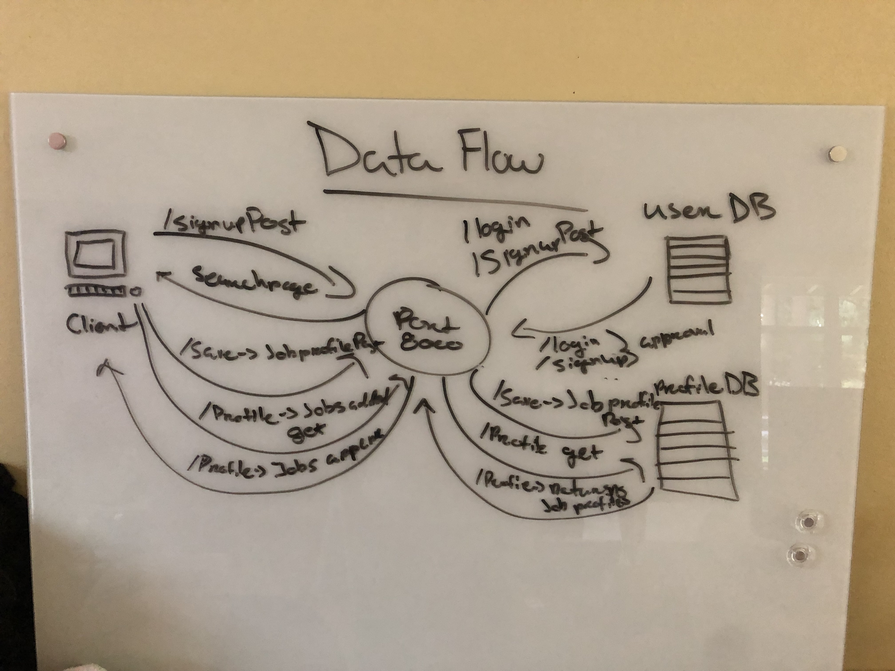
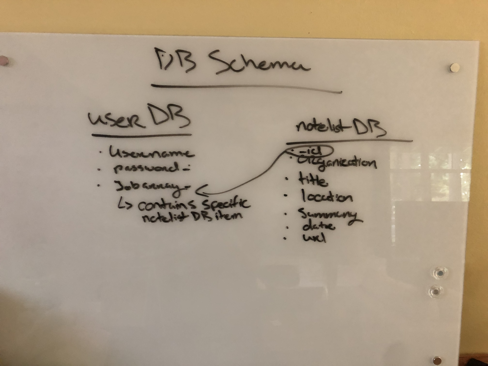

# Project JobberWocky

## We are deployed on GitHub
[JobberWocky Web App](https://erikmjohnson.github.io/getTheJob_frontend/)
-

## Web Application

Since we were about to graduate from coding bootcamp, we decided to build a job searching website. This website is 
different from other job searching websites in that you are able to check multiple job sites at once with a particular
job search. Once the list appears, you can add it to your profile and keep track of the different jobs you have been
applying to.
---------------------------------
## Tools Used

* @material-ui/core
* @material-ui/icons
* cross-fetch
* gh-pages
* node-sass
* react
* react-dom
* react-redux
* react-router-dom
* react-scripts
* redux
* redux-devtools-extension
* redux-form
* superagent
* uuid
---------------------------------
## Getting Started
Clone this repository to your local machine.
```
$ git clone https://github.com/erikmjohnson/getTheJob_frontend.git
```
Once downloaded, install the packages.
```
cd YourRepo/YourProject
`npm i`
```
---------------------------------
## Usage
### Login Page

### Signin Page

### Job Search Page

### Listing

### Add listing

### My Profile

### Delete Item

---------------------------
## Data Flow (Frontend, Backend, REST API)

---------------------------
## Data Model
### Overall Project Schema

---------------------------
## Authors
* Erik M. Johnson
* Sarkis Aghazarian 
* Anthony Triplett
* Xochil
* Lorin Stewart 
------------------------------
